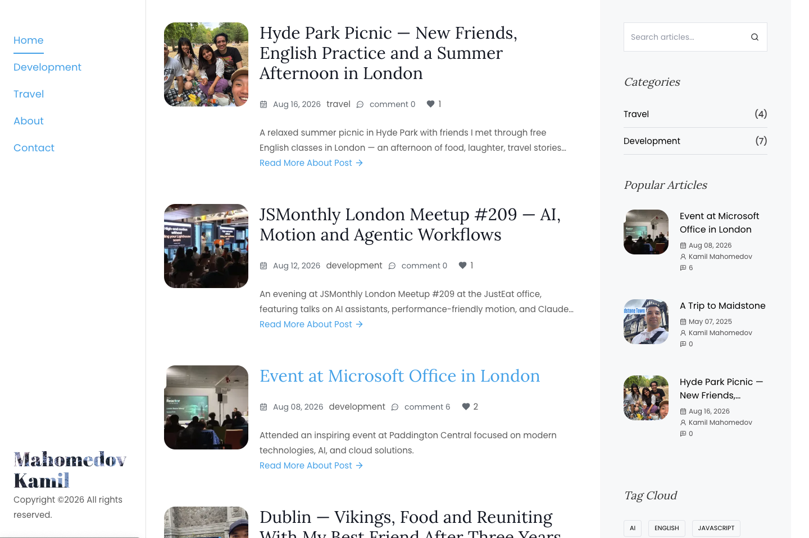
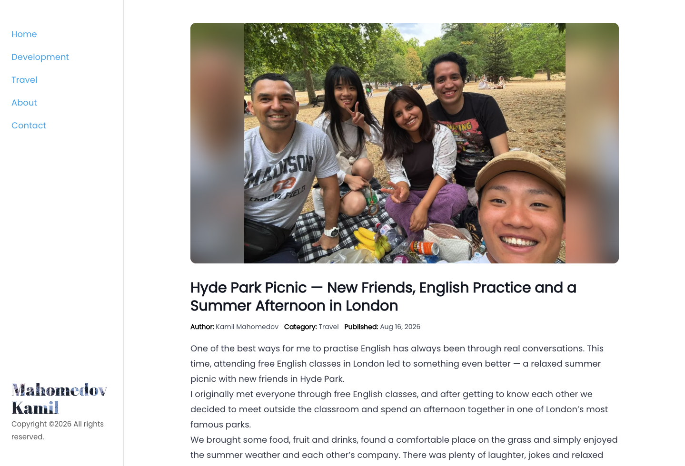
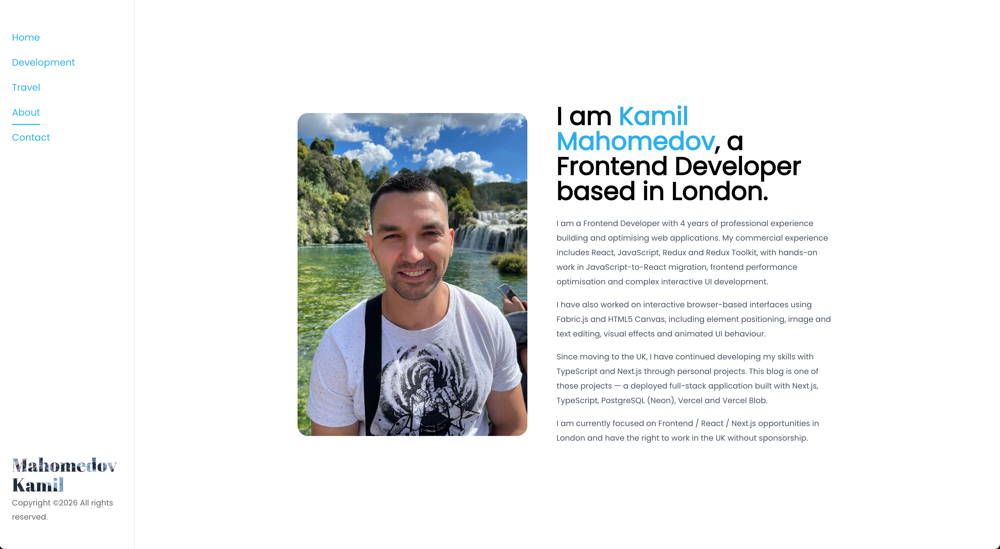
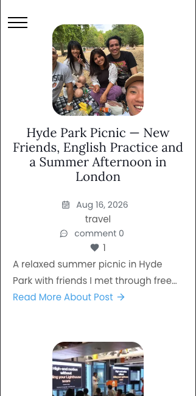

# Kamil's Blog

A full-stack personal blog built with Next.js, TypeScript, PostgreSQL (Neon) and Vercel.

The project combines two of my main interests: software development and travel. I use the blog to publish articles about tech meetups, programming, travel experiences and life in London.

The application was developed as both a personal blog and a portfolio project, with a focus on responsive design, maintainable structure, type safety and real-world functionality.

## Live Demo

🔗 [View the live website](https://blog-ten-rho-43.vercel.app)

## Engineering Highlights

- Migrated backend functionality into **Next.js Route Handlers**, keeping frontend and server-side logic within the same Next.js application.
- Designed and worked with **PostgreSQL relational data** for posts, categories, tags, comments and nested replies.
- Improved **TypeScript data contracts** between PostgreSQL/API responses and frontend models, resolving data-shape and type inconsistencies across application layers.
- Implemented **search, category and tag filtering, pagination, and archive navigation** for dynamic blog content.
- Built post interaction functionality including **comments, nested parent-child replies, likes, views and comment counts**.
- Integrated **Vercel Blob** for image storage and deployed the application to production with Vercel.

## Tech Stack

### Frontend

- Next.js
- React
- TypeScript
- Tailwind CSS
- Lucide React

### Backend

- Next.js Route Handlers
- PostgreSQL (Neon)
- SQL
- Nodemailer

### Storage & Deployment

- Vercel
- Vercel Blob

## Screenshots

### Home



### Article



### About



### Mobile



## Features

### Content & Discovery

- Development and travel articles
- Dynamic article pages
- Keyword search
- Category and tag filtering
- Archive navigation by year and month
- Pagination and popular articles

### Post Interaction

- Likes and view tracking
- Comments and nested replies
- Optional comment avatars
- Comment counts

### Platform

- Newsletter subscriptions
- Contact form with email delivery
- Dynamic SEO metadata
- Loading skeletons
- Responsive desktop, tablet and mobile navigation

## Architecture

The project uses the Next.js App Router and combines frontend and server-side functionality within the same application.

```text
Browser
   │
   ▼
Next.js / React
   │
   ├── Server Components
   ├── Client Components
   │
   ▼
Next.js Route Handlers
   │
   ├── Comments
   ├── Likes
   ├── Views
   ├── Newsletter
   ├── Contact Form
   └── User Visits
   │
   ▼
PostgreSQL (Neon)
```

Images uploaded through the application are stored separately in Vercel Blob.

## Database

The application uses PostgreSQL hosted on Neon.

Main entities include:

- Posts
- Categories
- Tags
- Post–tag relationships
- Comments and replies
- Newsletter subscriptions

Posts belong to categories and can be associated with multiple tags.

Comments use parent-child relationships, allowing nested replies to existing comments.

## Project Structure

```text
src/
├── app/
│   ├── about/
│   ├── api/
│   ├── contact/
│   ├── development/
│   ├── post/
│   └── travel/
│
├── components/
├── contexts/
├── data/
├── lib/
├── styles/
├── tests/
└── types/
```

### `app`

Contains pages and API Route Handlers using the Next.js App Router.

### `components`

Reusable React components used across the application.

### `lib`

Database queries, API logic, helpers and shared application utilities.

### `types`

TypeScript interfaces for application and database data.

## Environment Variables

Create a `.env.local` file in the project root.

```env
DATABASE_URL=
BLOB_READ_WRITE_TOKEN=
EMAIL_USER=
EMAIL_PASS=
```

### Variables

`DATABASE_URL`

Connection string for the Neon PostgreSQL database.

`BLOB_READ_WRITE_TOKEN`

Token used to upload images to Vercel Blob.

`EMAIL_USER`

Email account used by the contact form and comment notification system.

`EMAIL_PASS`

Email application password used by Nodemailer.

> Never commit real environment variable values to Git.

## Getting Started

Clone the repository:

```bash
git clone https://github.com/KamilMagomedov/blog.git
```

Open the project directory:

```bash
cd blog
```

Install dependencies:

```bash
npm install
```

Create your `.env.local` file and add the required environment variables.

Run the development server:

```bash
npm run dev
```

Open:

```text
http://localhost:3000
```

## Quality Checks

The project uses automated quality checks to validate code quality, type safety, tests, formatting and the production build.

### ESLint

```bash
npm run lint
```

## Author

**Kamil Mahomedov**

Frontend Developer based in London.

- GitHub: [KamilMagomedov](https://github.com/KamilMagomedov)
- LinkedIn: [Kamil Mahomedov](https://www.linkedin.com/in/kamil-mahomedov/)
